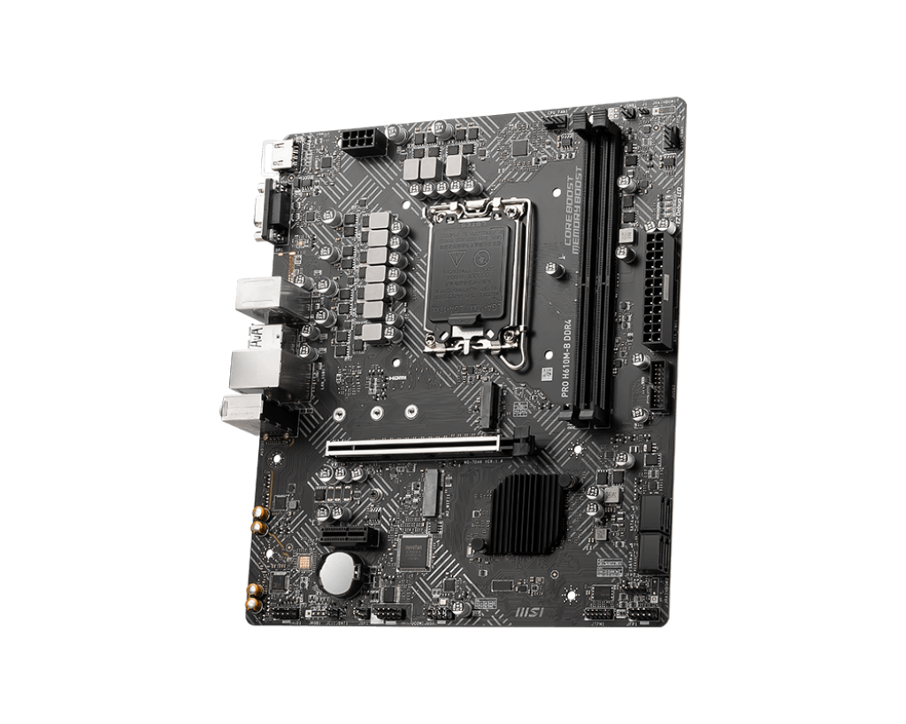
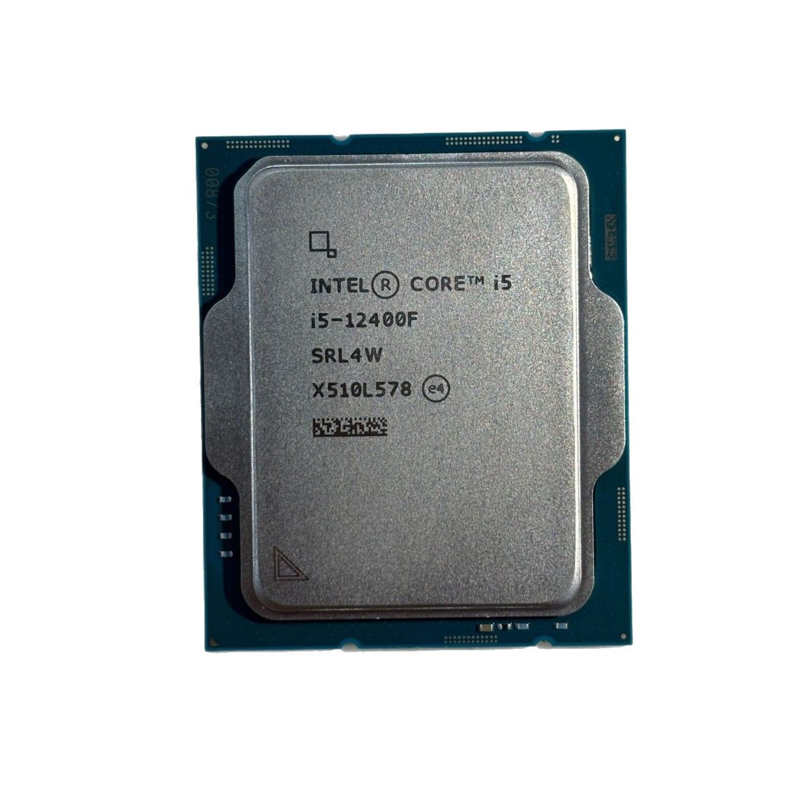
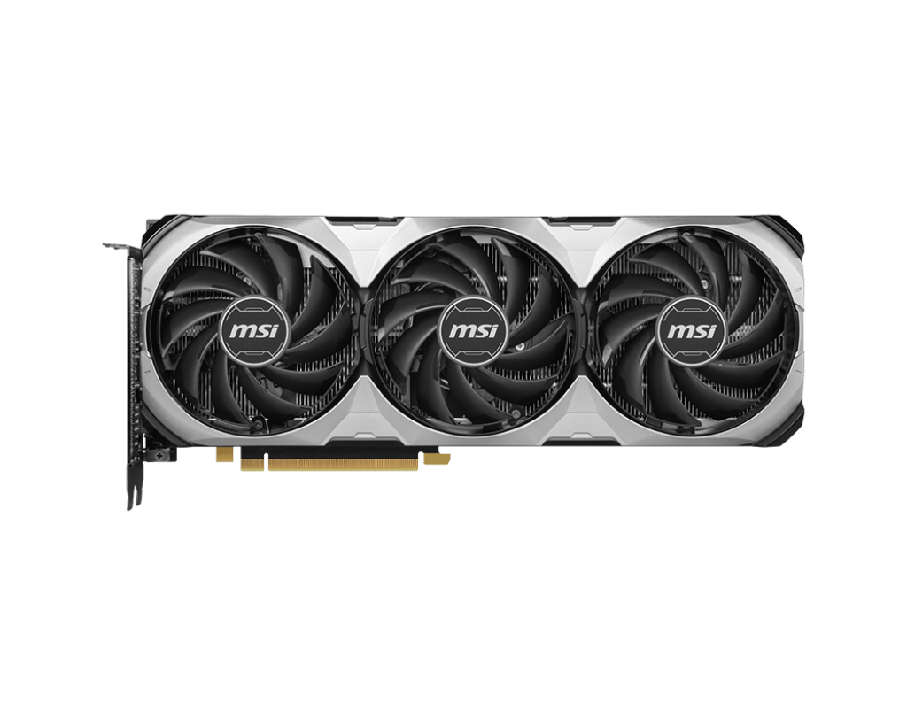
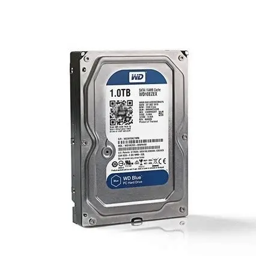
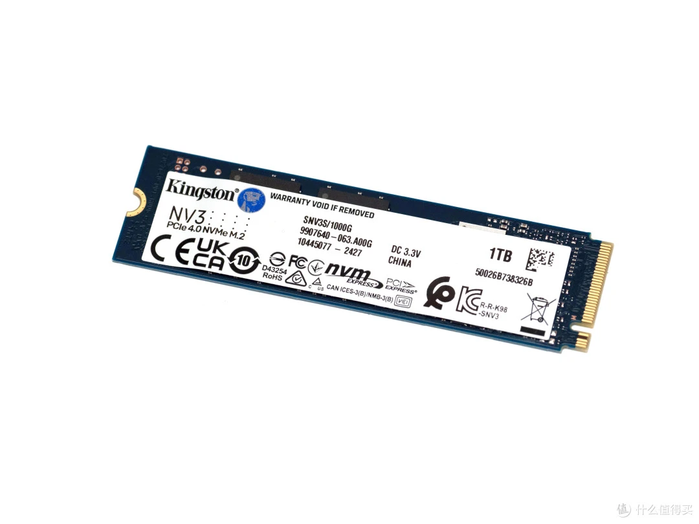
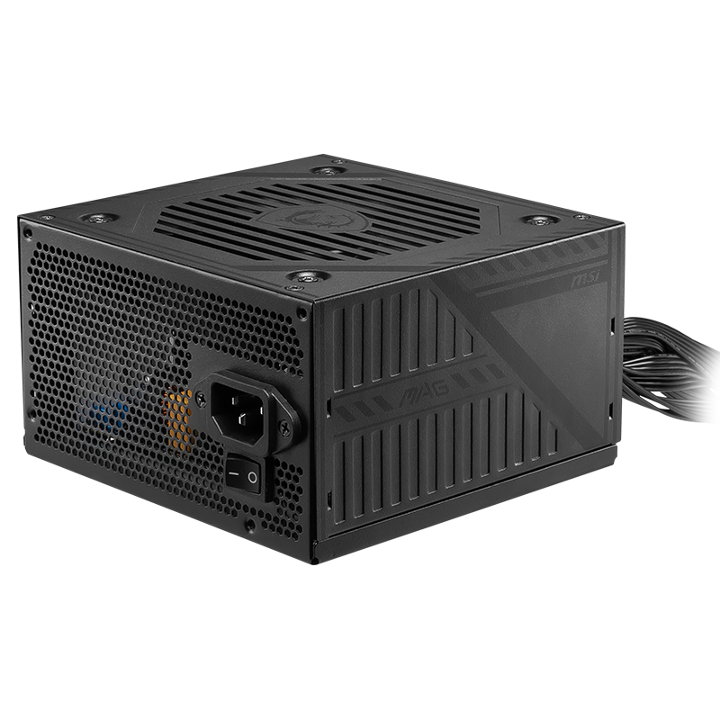

:::tip
这是在阅读该教程之前你需要做到的
:::

- 你的脑子能够进行基本的运算
- 知道并理解如何尝试使用百度必应谷歌搜索问题并解决问题

:::note
在本期教程你将会学习到组成电脑的基本硬件，基本输入与输出设备的使用等
:::

# 组成电脑的基本硬件

## 主板

主板是一台电脑的核心组件,它的模样如图：

它上面集成了CPU插槽，内存插槽，PCIe插槽等，不同的主板插槽的数量可能不同。

## CPU

CPU即中央处理器，是计算机的大脑，负责执行指令和处理数据。
它的模样如图：

CPU也分不同的类型，如ARM，X86，X64，也分品牌，如Intel，AMD等。每个类型的CPU都有不同类型的插槽，如LGA1154，AM4等。在购买之前需要先确认自己的主板是否支持自己的CPU。

## 内存

内存（RAM）是计算机用来暂时存储数据的组件。
它的模样如图：

内存也分不同的类型，如（第四代）DDR4，（第五代）DDR5等。频率也分不同，如2400MHz，3200MHz等。和cpu一样在购买之前需要先确认自己的主板支持的为第几代的内存。

## 显卡

显卡（GPU）是计算机用来处理图形和视频的组件。对，没错，你打游戏爽不爽就要看你装不装上它了（特别拉跨的除外）
它的模样如图：

显卡分不同的品牌，但是他们的插槽都是一致的，所以只需看自己的机箱放不放的下和电源是否能够支持你这一套配置了。

## 硬盘

硬盘是计算机用来存储数据硬件，常见分为HDD（机械硬盘）与SSD（固态硬盘）。
它的模样如图：

硬盘分不同的接口，M.2,Nvme，sata等接口。容量也分不同，如512GB，1TB等。在购买之前你需要先确认你需要多大的存储空间。

## 电源

电源是计算机用来提供电的硬件。
它的模样如图：

电源分不同的类型，如金牌，银牌等。电源线缆可能为自带，也可能需要自己连接电源。功率需要你按照自己的配置选择，一般来说，配置越高，需要的电功率也就越高。

## 机箱

大家应该都多多少少的见过了，所以在这里不过多论述，只需要知道机箱分ITX机箱与ATX机箱等，与主板大小息息相关。

# 电脑的基本输入与输出设备

在高中信息技术课本上我们可以很明确的得知基础输入设备有

- 键盘
- 鼠标
- 触摸屏
- 摄像头
- 等

基础输出设备有

- 显示器
- 音响
- 打印机
- 等

## 电脑的基本快捷键

在使用电脑的时候快捷键可以极大的提高工作效率，以下是一些常用的快捷键

- ctrl + c 复制
- ctrl + v 粘贴
- alt + F4 强制关闭当前窗口
- win + d 显示桌面
- win + i 打开设置
- win + r 打开运行窗口
- win + l 锁屏
- ctrl + alt + del 打开安全选项面板
- alt + tab 切换窗口
- win + shift + s 截图

:::tips
部分软件拥有着自己的快捷键
:::

# 本期教程到此结束，下期将是常用软件的安装与使用
