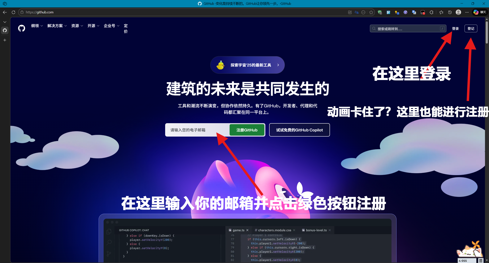
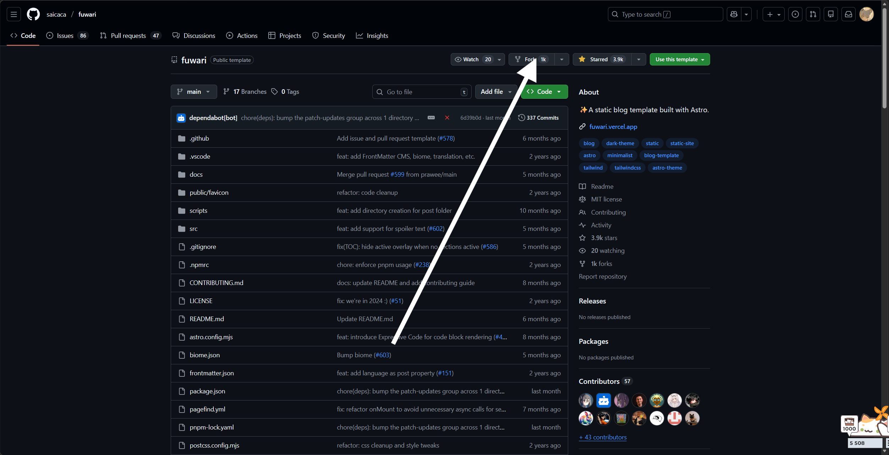
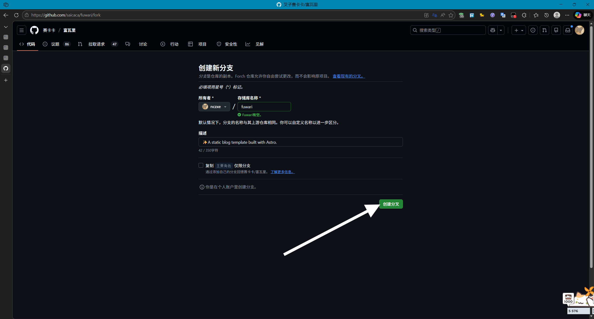
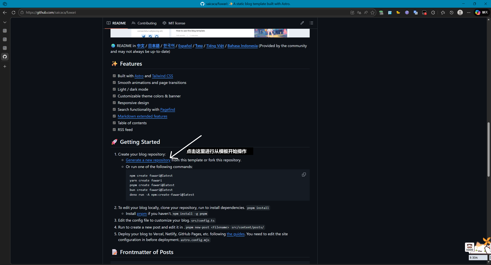
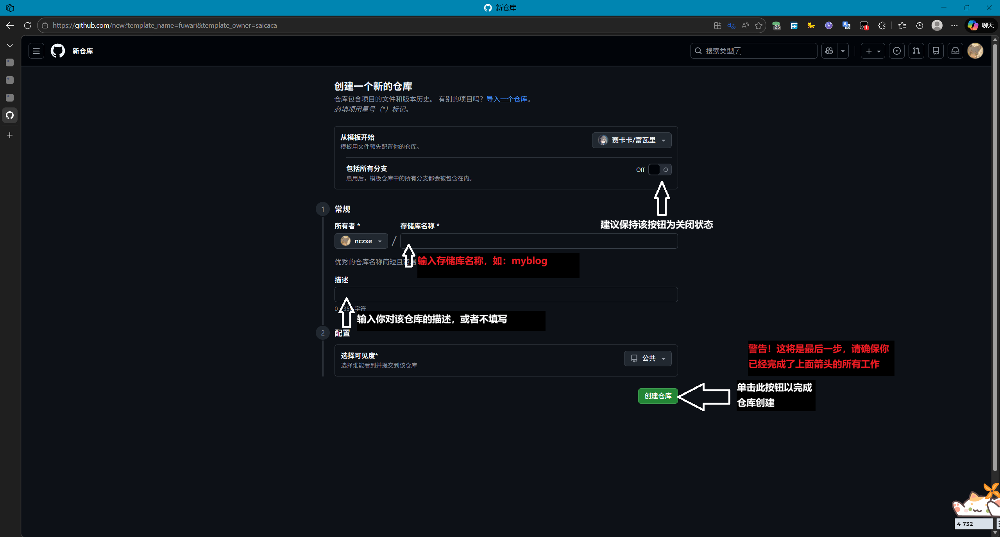
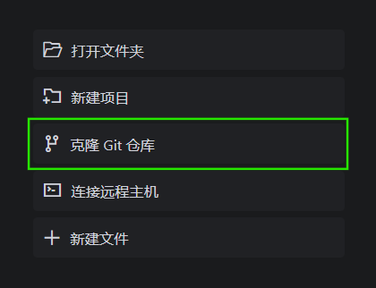

:::tip
这是在阅读该教程之前你需要做到的
:::

- 你的脑子能够进行基本的运算
- 知道并理解如何尝试使用百度必应谷歌搜索问题并解决问题
- 你知道并理解一些基础知识
- 一个能连接到这些网页的网络环境

:::note[本期教程会教的]
你将会学习如何Fork并部署一个基于Fuwari的博客到Cloudflare的Workers上
:::

:::note[本期教程不会教的]
自定义博客外观及内容，统计服务的添加等
:::

# 步骤快速先知

在开始之前需要先讲解我们要做的步骤

1. Fork Fuwari仓库
   - 你需要先创建一个github账号
   - 访问[Fuwari仓库](https://github.com/saicaca/fuwari)
   - Fork仓库

2. 安装git（不做教程）
   - 访问git官网[https://git-scm.com/](https://git-scm.com/)下载并安装git
   - 在安装完成后打开git bash（windows用户）或者终端
   - 检查git是否安装成功，在开始菜单搜寻git bash相关内容或在终端输入`git --version`，如果显示版本号则安装成功
   - 配置git，在终端输入以下命令，这有关你的克隆到本地和本地提交时的问题

     ```bash
     git config --global user.name "这里输入你的用户名"
     ```

     ```bash
     git config --global user.email "这里输入你的邮箱"
     ```

   - 检查git配置，在终端输入`git config --global --list`，如果显示你配置的用户名和邮箱则配置成功

:::tip
注意！你可能在克隆或提交时遇到登录问题，请按照指引进行登录
:::

3. 进行本地修改并提交
   - 在你所使用的编译器中使用Git克隆你的仓库到本地（选择克隆git仓库）
   - 在你进行编辑时建议在编辑器中安装node.js环境与astro插件以及markdown插件，这将有利于你更好的看懂代码
   - 进行你惊为天人的修改
   - 进行本地预览并提交变更

4. 部署到cloudflare workers
   - 创建一个cloudflare账号
   - 注册一个域名并添加域名到cloudflare
   - 从github仓库部署workers
   - 配置workers使用的域名

5. 完成

# 正式开始

## 第一步：Fork Fuwari仓库

1. 打开[GitHub.com](https://github.com/)注册或者登录一个账号
   

2. Fork [Fuwari仓库](https://github.com/saicaca/fuwari)仓库（你也可以在仓库readme文件寻找从模板开始按钮进行,本次由从模板开始进行）
   
   
   
   

## 第二步：进行本地编辑并提交

1. 拉取你的仓库到本地
   - 本次使用的编译器为Trae
   - 点按克隆git仓库按钮
     
   - 选择从远程源拉取（github）
   - 登录github账号进行拉取
   - 选择仓库并选择保存路径
   - 等待拉取完成（失败了是什么情况？git所需网络环境苛刻，请检查网络是否能够连通国际网络）
2. 在Trae中进行编辑
   fuwari的文件结构如下:

```
fuwari/
├── .github/          # GitHub 配置文件，包括 issue 模板、工作流和依赖自动更新
├── .vscode/          # VS Code 编辑器配置
├── docs/             # 多语言文档
├── public/           # 静态资源，包括图标
├── scripts/          # 辅助脚本
├── src/              # 主要源代码目录
│   ├── assets/       # 资源文件
│   ├── components/   # UI 组件，分为控制组件、通用组件和小部件
│   ├── constants/    # 常量定义
│   ├── content/      # 内容文件，包括博客文章
│   ├── i18n/         # 国际化支持
│   ├── layouts/      # 页面布局
│   ├── pages/        # 页面定义
│   ├── plugins/      # 插件
│   ├── styles/       # 样式文件
│   ├── types/        # TypeScript 类型定义
│   └── utils/        # 工具函数
└── 根目录配置文件       # 项目配置文件，包括构建工具、依赖管理等
```

3. 本地验证
   - 安装node.js
   - 在Trae中打开终端
   - 输入`npm install -g pnpm`安装pnpm
   - 在所在仓库根目录输入`pnpm install`安装依赖
   - 输入`pnpm run dev`启动本地服务器
   - 打开浏览器访问`http://localhost:4321`查看效果

4. 提交
   - 在IDE模式中源代码管理位于左侧栏，单击它后点击提交一路下去就行
   - 在SOLO模式下源代码管理位于右侧资源管理器的顶栏上，单击它后与IDE模式下的操作相同

## 第三步：部署到cloudflare workers

1. 创建一个cloudflare账号
   - 访问[cloudflare](https://dash.cloudflare.com/login)并注册一个账号
2. 获取一个域名
   - 免费的域名注册商 [DigitalPlat Domain](https://domain.digitalplat.org/) 部分域需要收取KYC验证费用
   - 注意：域名注册有效期为一年，但在180天内将要过期能够进行延长一年操作
     
3. 将域名绑定到cloudflare
   - 在cloudflare登录后点按添加域按钮
   - 输入你现有的域名（是否阻止AI爬网由您决定）
   - 选择免费计划
   - 在DNS扫描完毕后选择继续前往激活
   - 在服务提供商处更改DNS服务器为cloudflare给出的DNS服务器
4. 将服务部署到cloudflare workers
   - 在仓库根目录下创建一个workers.json文件，内容为下

     ```json
     {
       "name": "你的workers名称",
       "compatibility_date": "版本时间，例如：2026-01-10",
       "assets": {
         "directory": "./dist"
       }
     }
     ```

   - 在cloudflare主页中点击左侧的构建中的AI与计算中的Workers与Pages
   - 点击创建应用程序
   - 选择Continue with Github（需要登录Github账号）
   - 选择你想要部署仓库后点击下一步
   - 最后点击进行部署

5. 配置域名
   - 在workers中点击你刚刚创建的workers应用程序，进入概述页面后点按设置按钮
   - 点击查看设置按钮后点击域和路由右边的添加
   - 选择自定义域
   - 输入你的域名或者 \*.你的域名
   - 点击添加自定义域再点击添加域即可完成

# 总结

本期教程已经结束，下一步正式开始你的网络冲浪之旅吧
